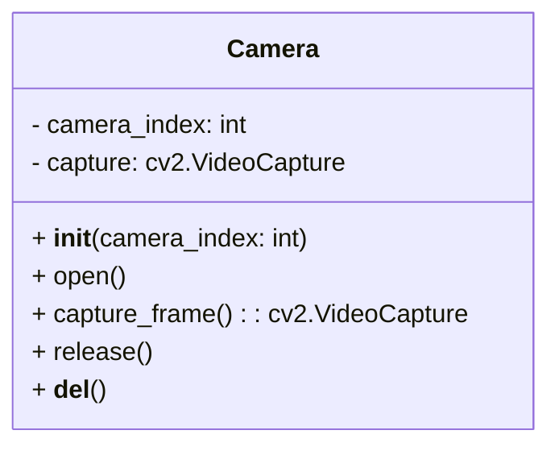

```mermaid
classDiagram
    class Camera {
        - camera_index: int
        - capture: cv2.VideoCapture
        + __init__(camera_index: int)
        + open()
        + capture_frame(): cv2.VideoCapture
        + release()
        + __del__()
    }
```