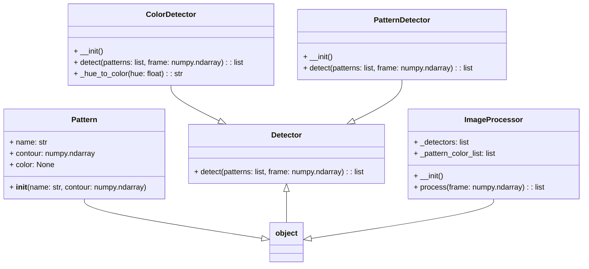

```mermaid
classDiagram
    class Pattern {
        + name: str
        + contour: numpy.ndarray
        + color: None
        + __init__(name: str, contour: numpy.ndarray)
    }
    Pattern --|> object

    class Detector {
        + detect(patterns: list, frame: numpy.ndarray): list
    }
    Detector <|-- object

    class ImageProcessor {
        + _detectors: list
        + _pattern_color_list: list
        + __init()
        + process(frame: numpy.ndarray): list
    }
    ImageProcessor --|> object

    class ColorDetector {
        + __init()
        + detect(patterns: list, frame: numpy.ndarray): list
        + _hue_to_color(hue: float): str
    }
    ColorDetector --|> Detector

    class PatternDetector {
        + __init()
        + detect(patterns: list, frame: numpy.ndarray): list
    }
    PatternDetector --|> Detector
```