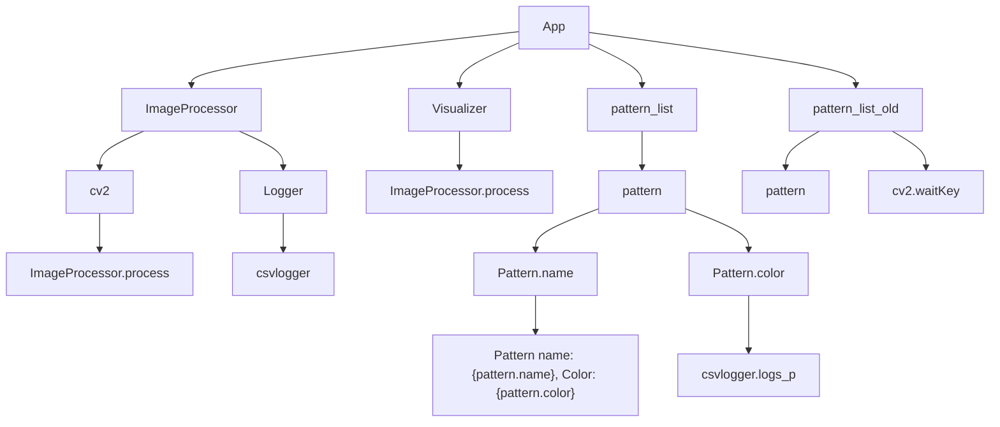

```mermaid
graph TD
    A[App] --> B[ImageProcessor]
    A --> C[Visualizer]
    B --> D[cv2]
    B --> E[Logger]
    D --> F[ImageProcessor.process]
    E --> G[csvlogger]
    C --> H[ImageProcessor.process]
    A --> I[pattern_list]
    A --> J[pattern_list_old]
    I --> K[pattern]
    J --> L[pattern]
    K --> M[Pattern.name]
    K --> N[Pattern.color]
    M --> O["Pattern name: {pattern.name}, Color: {pattern.color}"]
    N --> P[csvlogger.logs_p]
    J --> Q[cv2.waitKey]
```