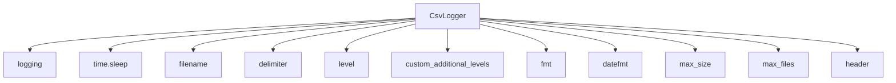

# Logger

```mermaid
graph TD
    A[CsvLogger] --> B[logging]
    A --> C[time.sleep]
    A --> D[filename]
    A --> E[delimiter]
    A --> F[level]
    A --> G[custom_additional_levels]
    A --> H[fmt]
    A --> I[datefmt]
    A --> J[max_size]
    A --> K[max_files]
    A --> L[header]
```

